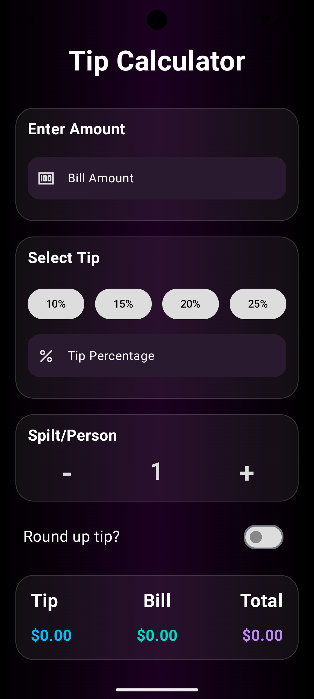
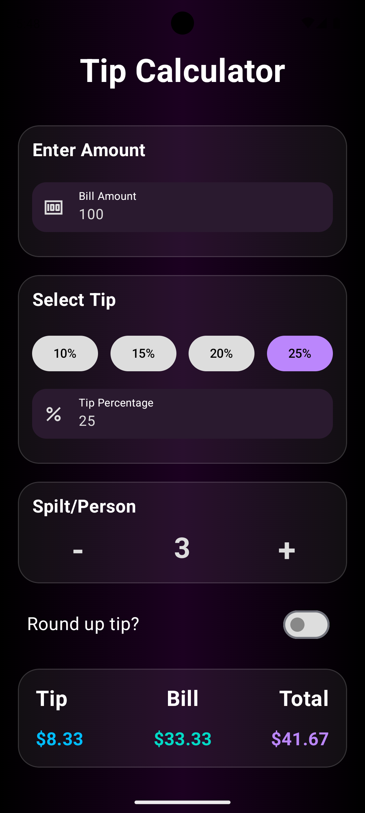
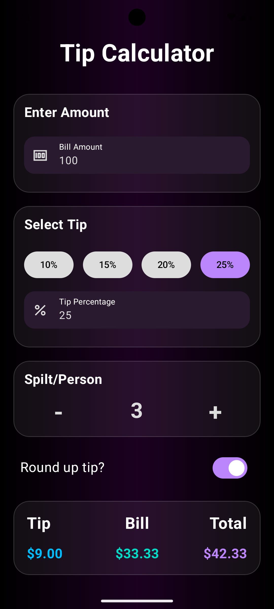

# Tip Calculator 📱


A modern **Tip Calculator** Android app built with **Kotlin** and **Jetpack Compose**.  
Calculate tips instantly, split the bill per person, and optionally round up the tip — with real-time updates and locale-based currency formatting.

## Preview 🎬

<p align="center">
  
</p>

## Screenshots 📸

| App Appearance                                  | Amount & Tip Selection                          | Split Bill & Round Up                           |
|-------------------------------------------------|-------------------------------------------------|-------------------------------------------------|
|  |  |  |

## ✨ Features

- Calculate tip based on bill amount and selected percentage
- Preset tip options (10%, 15%, 20%, 25%)
- Custom tip percentage input
- Split bill between multiple people
- Optional round-up tip functionality
- Real-time calculations with Jetpack Compose state
- Currency formatted based on device locale
- Clean modern UI built with Material 3

## 🧠 What this project demonstrates

- Tip calculation logic implementation
- Bill splitting algorithm per person
- MVVM architecture pattern
- ViewModel state management
- Reactive UI updates based on state changes
- Material 3 UI components
- Custom composable UI components
- Currency formatting based on device locale
- Local Unit Testing for business logic
- Android Instrumentation Testing

## 🛠 Tech Stack

**Language**
- Kotlin

**UI**
- Jetpack Compose
- Material 3

**Architecture**
- MVVM (Model-View-ViewModel)
- Jetpack Compose state management
- Android ViewModel

**Tools**
- Android Studio
- Gradle

## 📂 Project Structure

```
TipCalculator
│
├── app
│   ├── src
│   │   ├── main
│   │   │   ├── java/com/example/tipcalculator
│   │   │   │   └── MainActivity.kt
│   │   │   │   └──viewmodel
│   │   │   │       └──TipCalculatorViewModel.kt
│   │   │   ├── res
│   │   │   └── AndroidManifest.xml
│   │   │
│   │   ├── test
│   │   │   └── Local Unit Tests
│   │   │
│   │   └── androidTest
│   │       └── Instrumentation Tests
│
├── preview
│   └── tip_calculator_demo.gif
│
├── screenshots
│   ├── screen1.png
│   ├── screen2.png
│   └── screen3.png
│
├── README.md
└── Gradle configuration files
```

## 🧪 Testing

This project includes both **Local Unit Tests** and **Android Instrumentation Tests**.

### Local Unit Tests

Local unit tests verify the correctness of the core calculation logic.

Tested functions include:

- `calculateTip()`
- `calculateBill()`
- `calculateTotalBill()`

Run local tests with:

```bash
./gradlew test
```

Run from Android Studio → Run Tests in 'test'

### Instrumentation Tests

Instrumentation tests verify the behavior of Android components on a real device or emulator.

These tests ensure that the application UI and Android framework interactions work correctly.

Run instrumentation tests with:

```bash
./gradlew connectedAndroidTest
```
Run from Android Studio → Run Tests in 'androidTest'

## 🚀 Installation

Follow these steps to run the project locally.

### 1 Clone the repository

```bash
git clone https://github.com/petrakip/tip-calculator.git
```

## 📋 Requirements

To build and run this project you need:

- Android Studio (Hedgehog or newer recommended)
- Android SDK
- Kotlin
- Android Emulator or physical Android device

## 👨‍💻 Author

Developed by **Panagiota Petraki**

GitHub:  
https://github.com/petrakip
